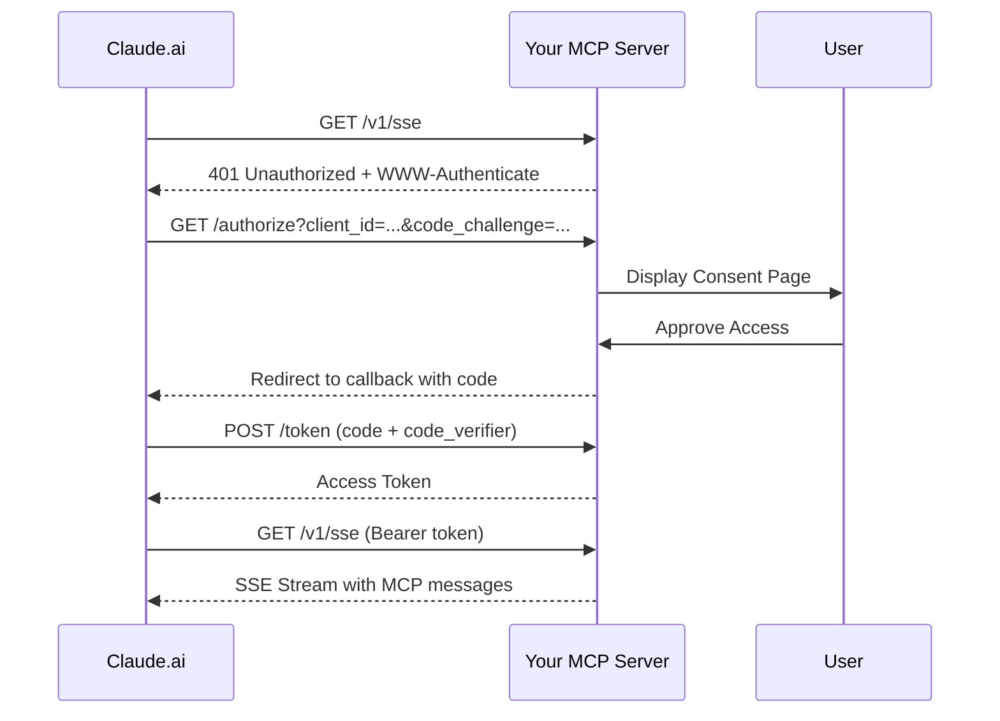

# Claude.ai MCP Remote Server - EXACT Configuration Required

## Actual OAuth Request from Claude.ai

When Claude.ai connects to your MCP server, it sends:

```
https://mcp.changeflow.us/authorize?
  response_type=code
  &client_id=8f73a025-a1f2-4c84-8f2d-43b77ec9117f
  &redirect_uri=https%3A%2F%2Fclaude.ai%2Fapi%2Fmcp%2Fauth_callback
  &code_challenge=oeqH6ISYQcPPFt9pmvzU1rqJEMiMC4ZyaelL1HJMaug
  &code_challenge_method=S256
  &state=CXHJxTJtGDwnubO5omp-45zXcf7YmRRKEFtKr-B1Xe4
  &scope=claudeai
```

## Critical Requirements for Claude.ai Integration

### 1. OAuth 2.0 with PKCE
- **response_type**: `code` (authorization code flow)
- **client_id**: Dynamic UUID generated by Claude.ai
- **redirect_uri**: Always `https://claude.ai/api/mcp/auth_callback`
- **code_challenge**: PKCE challenge (Base64URL encoded)
- **code_challenge_method**: `S256` (SHA256)
- **state**: Random string for CSRF protection
- **scope**: `claudeai`

### 2. Required Endpoints

#### `/authorize` - OAuth Authorization Endpoint
- Must accept GET requests with above parameters
- Should display consent page
- Must redirect to Claude.ai callback with authorization code

#### `/token` - OAuth Token Exchange
- POST endpoint
- Exchange authorization code for access token
- Must validate PKCE code_verifier

#### `/v1/sse` - MCP Protocol Endpoint
- Initial request returns 401 if no auth
- With Bearer token: returns SSE stream
- Implements MCP protocol over Server-Sent Events

#### `/.well-known/oauth-authorization-server` - Discovery Endpoint
- Returns OAuth server metadata
- Required for automated configuration

### 3. Authentication Flow



### 4. Current Implementation Issues

#### ❌ Dynamic Client Registration
Claude.ai sends a different `client_id` each time. Our current implementation expects a fixed GitHub OAuth client_id.

**Required Fix**:
```javascript
// Accept any client_id from Claude.ai
case '/authorize':
  const clientId = url.searchParams.get('client_id');
  // Don't validate against fixed GITHUB_CLIENT_ID
  // Claude.ai generates UUIDs dynamically
```

#### ❌ PKCE Validation
Must properly handle code_challenge and code_verifier:

```javascript
// Store code_challenge with authorization code
authCodes.set(code, {
  clientId,
  redirectUri,
  codeChallenge,
  codeChallengeMethod
});

// Validate in /token endpoint
const codeVerifier = params.get('code_verifier');
const challenge = authCode.codeChallenge;
const method = authCode.codeChallengeMethod;

if (method === 'S256') {
  const hash = await crypto.subtle.digest('SHA-256',
    new TextEncoder().encode(codeVerifier));
  const computed = base64url(hash);
  if (computed !== challenge) {
    return error('invalid_grant');
  }
}
```

#### ❌ Scope Handling
Claude.ai requests `scope=claudeai`, not GitHub scopes:

```javascript
// Accept claudeai scope
const scope = url.searchParams.get('scope');
if (scope === 'claudeai') {
  // Grant MCP access
}
```

### 5. Cloudflare Deployment Configuration

**wrangler.toml** (current):
```toml
name = "guile-changeflow-prod"
main = "worker.js"
compatibility_date = "2025-01-13"

[vars]
ENVIRONMENT = "production"
LOG_LEVEL = "info"
GITHUB_CLIENT_ID = "Ov23lir2JJgJffb51RPs"  # Not used for Claude.ai!
```

**Custom Domain**: Required for Claude.ai
- Must use `mcp.changeflow.us` (configured in Cloudflare dashboard)
- Cannot use `.workers.dev` subdomain

### 6. Testing with Claude.ai

1. Open Claude.ai
2. Go to Settings → Developer → MCP Servers
3. Add server: `https://mcp.changeflow.us`
4. Claude.ai will:
   - Try to GET `/v1/sse`
   - Receive 401
   - Redirect to `/authorize` with parameters shown above
   - Expect consent page
   - Handle callback to `https://claude.ai/api/mcp/auth_callback`

### 7. Critical Success Factors

✅ **Working**:
- Basic OAuth flow structure
- SSE endpoint returns 401 when unauthenticated
- Discovery endpoint exists
- Custom domain configured

❌ **Needs Fixing**:
- Dynamic client_id acceptance (currently expects GitHub client)
- PKCE validation implementation
- Scope validation for "claudeai"
- Session/token management for Claude.ai clients

### 8. Minimum Viable Fix

To make it work with Claude.ai RIGHT NOW:

```javascript
case '/authorize':
  // Accept ANY client_id from Claude.ai
  const clientId = url.searchParams.get('client_id');
  const redirectUri = url.searchParams.get('redirect_uri');

  // Skip GitHub OAuth, just show consent and redirect
  if (redirectUri.startsWith('https://claude.ai/')) {
    // Generate authorization code
    const code = generateRandomCode();

    // Store for token exchange
    authCodes.set(code, {
      clientId,
      redirectUri,
      codeChallenge: url.searchParams.get('code_challenge'),
      codeChallengeMethod: url.searchParams.get('code_challenge_method')
    });

    // Show consent page that auto-approves
    return new Response(consentPageHTML(code, state, redirectUri), {
      headers: { 'Content-Type': 'text/html' }
    });
  }
```

This would bypass GitHub OAuth entirely for Claude.ai connections while keeping the GitHub flow for other use cases.

---
Generated: 2025-09-15 01:45 UTC