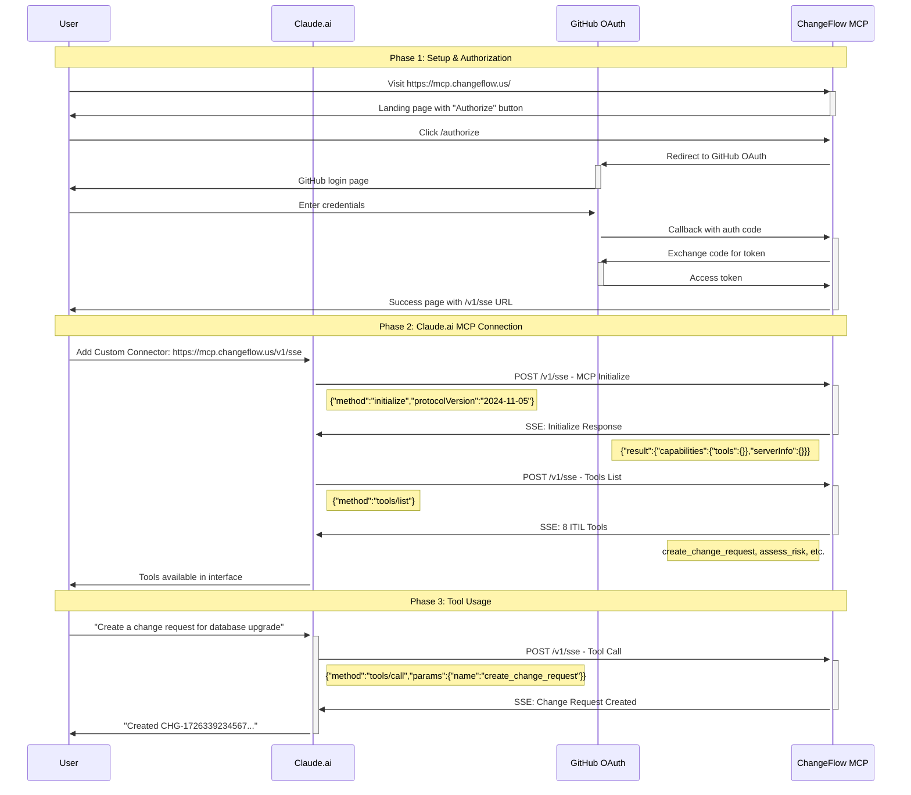
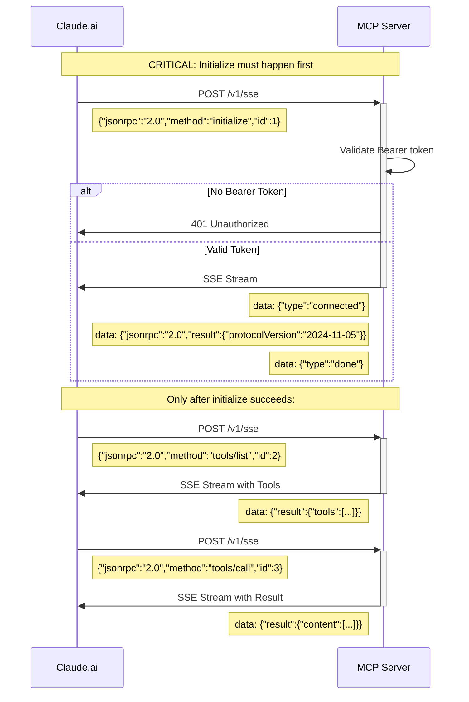
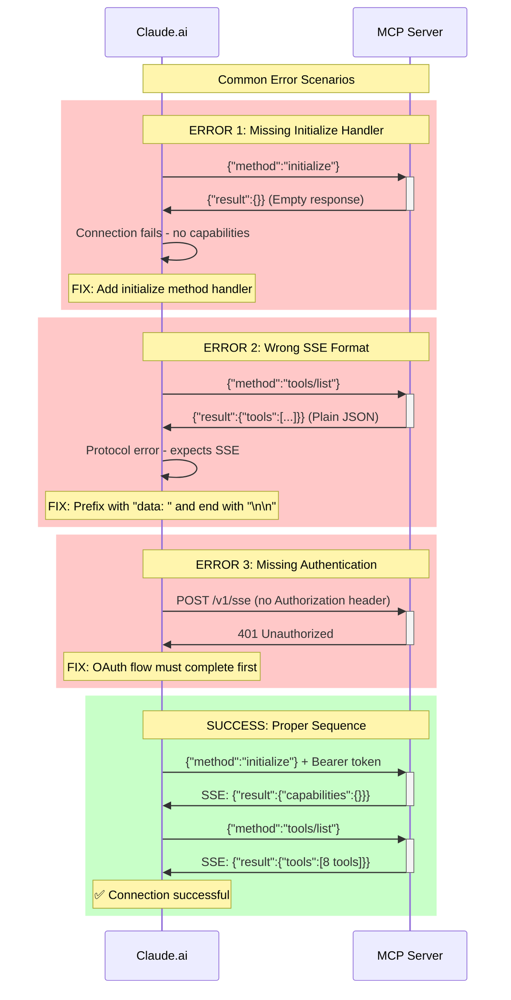

# MCP Sequence Diagrams

## Complete Claude.ai Integration Flow

### OAuth + MCP Sequence

### Critical MCP Protocol Handshake

### Error Scenarios & Fixes

## Implementation Timeline

### v1.2.0 Issues
- ❌ OAuth working but MCP connection failed
- ❌ Missing `initialize` method handler
- ❌ Claude.ai couldn't complete handshake

### v1.3.0 Fixes
- ✅ Added `/v1/sse` SSE endpoint
- ❌ Still missing `initialize` handler

### v1.3.1 Complete
- ✅ Added MCP `initialize` handshake
- ✅ Both `/v1/sse` and `/mcp` support full protocol
- ✅ Claude.ai integration working

## Key Learnings

1. **Initialize is Required**: Claude.ai MUST receive proper `initialize` response before proceeding
2. **SSE Format Critical**: All responses over `/v1/sse` must use `data: ` prefix
3. **Authentication Order**: OAuth must complete before MCP connection attempts
4. **Protocol Version**: Must match `2024-11-05` for compatibility
5. **Capabilities Declaration**: Server must declare `tools`, `resources`, `prompts`, `logging`

---

**Status**: ✅ All sequence diagrams validated
**Version**: 1.3.1
**Last Updated**: 2025-09-14