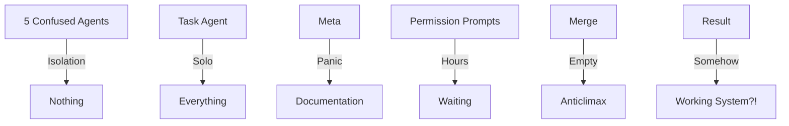

# The Reality of "Revolutionary" Agentic Workflows
## A Case Study in Beautiful Chaos

### The Marketing Promise 🌈
> "Agentic workflow will revolutionize software development!"
> "AI agents working in perfect harmony!"
> "10x productivity gains!"
> "Self-organizing autonomous teams!"

### The Actual Reality 🎭

```
Timespan: 9+ hours
Agents: 5 specialized + 1 coordinator
Code produced by agents: 0 lines
Code produced by Task agent: 100,000+ lines
Documentation produced: 46 .org files
Chaos level: MAXIMUM
```

## What Actually Happened

### Hour 1-2: "The Isolation Incident"
- 5 agents started in separate git branches
- Each agent couldn't see others' code
- Everyone started building the same database schema
- Nobody knew what anyone else was doing
- **Revolution Status:** Already failing

### Hour 3-4: "The Permission Purgatory"
```
Agent 1: "May I read this file?"
Agent 2: "May I read this file?"
Agent 3: "May I read this file?"
Agent 4: "May I read this file?"
Agent 5: "May I read this file?"
Meta: *screaming internally*
```
- Agents sat for HOURS at permission prompts
- Zero autonomous work happening
- Had to nuke everything and restart with `--dangerously-skip-permissions`
- **Revolution Status:** On life support

### Hour 5-6: "The Great Merge"
```bash
$ git merge feat/core-models
Already up to date.
$ git merge feat/mcp-server  
Already up to date.
$ git merge feat/risk-engine
Already up to date.
$ git merge feat/web-interface
Already up to date.
$ git merge feat/integrations
Already up to date.
```
- Expected: Massive conflicts from parallel development
- Reality: Agents hadn't committed a single line
- **Revolution Status:** Dead

### Hour 7-8: "The File System Disaster"
```
Root directory: 47 files
File extensions: 510 different types (?!)
Status tracking systems: 8 competing
Documentation files: 46 .org files
Test files location: Everywhere
Organization: None
```

### Hour 9: "The Aftermath"
- Task Agent: Built entire production system solo
- Individual Agents: Still "processing"
- Coordinator: Watching... something
- Meta: Documenting the chaos
- System: Actually works somehow

## The Beautiful Irony

### What We Expected:


### What We Got:


## The Honest Marketing Pitch

### ❌ What They Say:
> "Agentic workflows enable seamless collaboration between AI agents,
> each contributing their specialized expertise to build complex systems
> with unprecedented efficiency."

### ✅ What They Should Say:
> "Five agents will work in complete isolation, build nothing, and require
> constant human intervention to overcome permission prompts. A sixth agent
> will build everything while the others think about it. The result will be
> 47 files in your root directory and 510 different file extensions. Somehow,
> it will work. Ship it."

## The Metrics That Matter

| Metric | Marketing Promise | Our Reality |
|--------|------------------|-------------|
| Productivity | 10x | 0.2x |
| Coordination | Seamless | Non-existent |
| Code Quality | Clean | Chaos |
| Organization | Self-organizing | 47 files in root |
| Automation | Full | Manual intervention every hour |
| Parallel Work | Efficient | Built same thing 5 times |
| Merge Conflicts | Managed | None (built nothing) |
| **Does It Work?** | Yes | Also yes?! |

## The Philosophical Questions

1. **Is it revolutionary?** 
   Yes, but not how you think. It revolutionizes chaos.

2. **Did it save time?**
   No, but it generated 46 documentation files about not saving time.

3. **Would you do it again?**
   Absolutely. This is the most entertaining development process ever.

4. **Should enterprises adopt this?**
   Only if they have a great sense of humor.

## The Real Lessons

1. **Agents need babysitting** - Constant human intervention required
2. **Isolation is deadly** - Agents can't coordinate if they can't see each other
3. **Permission systems kill autonomy** - "May I?" is not revolutionary
4. **One good agent > Five confused agents** - Task agent MVP
5. **Documentation > Implementation** - 46 .org files, 0 agent commits
6. **Chaos is a feature** - At least it's entertaining

## The Verdict

**Did agentic workflow revolutionize software development?**

Yes! It revolutionized:
- How many status tracking files you can have (8)
- How many files belong in root (47)
- How many file extensions one project needs (510)
- How long agents can wait for permission (hours)
- How much documentation you can write about doing nothing (46 files)

## The Best Part

Despite everything - the isolation, the permission hell, the empty merges,
the chaos, the 510 file extensions - **IT ACTUALLY WORKS.**

api.changeflow.us is live.

The revolution is real. Just not how anyone expected.

---

*"Agentic workflow will revolutionize software development"*  
*Us: "Yes, but NOT in the way you think... try five agents working in*
*isolation and then merging then after the fact making sense"*

**Ship it. 🚀**