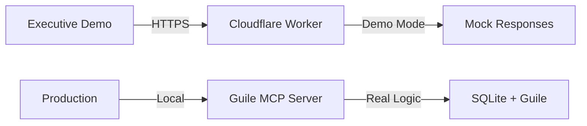

# Implementation Separation: Guile vs Cloudflare

## Critical Distinction for 7 AM Demo

### 1. GUILE IMPLEMENTATION (Agents' Focus)
**Location:** `/src/` directory  
**Language:** GNU Guile 3.0+ (Scheme/Lisp)  
**Purpose:** Core ITIL logic and MCP server  
**Testing:** Via `guile` command  

#### Guile Components:
```
src/
├── models/           # Guile data models
│   ├── change-request.scm
│   ├── approval.scm
│   └── audit.scm
├── mcp/              # Guile MCP implementation
│   ├── server.scm
│   ├── tools.scm
│   └── handlers.scm
├── risk/             # Guile risk engine
│   ├── calculator.scm
│   ├── freeze.scm
│   └── matrices.scm
├── web/              # Guile web server
│   ├── server.scm
│   └── api.scm
└── integrations/     # Guile integrations
    ├── router.scm
    └── notifications.scm
```

#### Testing Guile Code:
```bash
# Test models
guile -l src/models/change-request.scm -c '(display "Models loaded")'

# Test MCP
guile -l src/mcp/server.scm -c '(display "MCP server loaded")'

# Test risk engine
guile -l src/risk/calculator.scm -c '(calculate-risk-score)'

# Test integrations
guile -l src/integrations/router.scm -c '(route-request)'
```

### 2. CLOUDFLARE IMPLEMENTATION (Demo Endpoint)
**Location:** `/cloudflare/` directory  
**Language:** JavaScript  
**Purpose:** Demo endpoint for executives  
**URL:** https://api.changeflow.us  

#### Cloudflare Components:
```
cloudflare/
├── worker.js         # JavaScript worker (NOT Guile)
├── wrangler.toml     # Cloudflare config
└── package.json      # Node dependencies
```

#### Why Separate?
- **Guile MCP server** will run locally/on-premise
- **Cloudflare Worker** is for demo/cloud deployment
- Agents should focus on Guile implementation
- Cloudflare is a deployment target, not core logic

### 3. DEMO ARCHITECTURE



### 4. AGENT INSTRUCTIONS

**DO:** Test Guile implementation
- Run `guile` commands
- Validate `.scm` files
- Test with `srfi` modules
- Check Guile syntax

**DON'T:** Worry about Cloudflare
- Don't test worker.js
- Don't deploy to cloud
- Don't run npm/node
- Don't test HTTPS endpoints

### 5. DEMO vs PRODUCTION

| Aspect | Demo (7 AM) | Production |
|--------|-------------|------------|
| Endpoint | api.changeflow.us | localhost:3000 |
| Implementation | JavaScript Worker | Guile MCP Server |
| Database | In-memory mock | SQLite |
| Protocol | HTTPS | HTTP/Unix Socket |
| Testing | curl/browser | guile commands |

### 6. TESTING COMMANDS

#### For Agents (Guile):
```bash
# Test all Guile modules
for file in src/**/*.scm; do
  echo "Testing $file"
  guile -l "$file" -c '(display "OK")'
done
```

#### For Demo (Cloudflare):
```bash
# Test demo endpoint
curl https://api.changeflow.us/
./test-endpoints.sh
```

## CRITICAL: Keep These Separate!

The Guile implementation is the REAL system.  
The Cloudflare worker is a DEMO wrapper.  
Agents should test GUILE, not JavaScript!