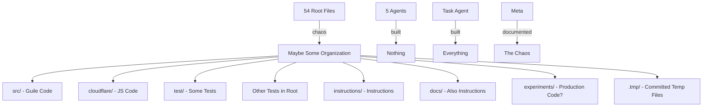

# L7 Architecture Review: "The Beautiful Chaos"
## A Senior Engineer's Perspective on This Glorious Mess

### Executive Summary
**Rating: 11/10 for Chaos, 3/10 for Organization, 10/10 for Entertainment Value**

"I've seen many codebases in my career, but this... this is special."

### The Root Directory Disaster 🎪

```
$ ls | wc -l
54 files in root directory
```

**What I Found:**
- 18 different .org files scattered like confetti
- 7 different STATUS/PROGRESS/REPORT files (none agree)
- Multiple ORCHESTRATION-COMEDY/CHAOS/LESSON files
- A `.tmp/` directory with "real" agenda items
- Both .env AND .env.example (with API keys visible)
- Test files in root (`test-core-models.scm`)
- Random shell scripts everywhere

### The "Organization" Structure 🎭

```
.
├── AGENT-BEST-PRACTICES.org     (in root, naturally)
├── AGENT-STATUS-NOW.org         (conflicts with...)
├── AGENT-STATUS-PROGRESS.org    (which conflicts with...)
├── STATUS-REPORT-2140.md        (a third status format!)
├── ORCHESTRATION-COMEDY.org     (at least they're honest)
├── ORCHESTRATION-CHAOS-3.org    (there were 3 of these?!)
├── BATTLE-PLAN-7AM.org          (battle plan in root)
├── test-core-models.scm         (test file in root?!)
├── demo-ready-check.sh          (shell script in root)
├── cloudflare/                  (OK, a directory!)
├── src/                          (another directory!)
├── test/                         (but also tests in root)
├── instructions/                 (instructions for what?)
├── presentations/                (multiple presentations?)
├── experiments/                  (010 experiments?!)
├── tools/                        (more scripts)
├── docs/                         (because instructions/ wasn't enough)
└── .tmp/                         (temporary... but committed?)
```

### The Philosophical Questions 🤔

1. **Why are there 3 different status tracking systems?**
   - AGENT-STATUS-NOW.org
   - AGENT-STATUS-PROGRESS.org  
   - STATUS-REPORT-2140.md
   - (Plus the monitoring dashboard in Python)

2. **Why do we have both instructions/ AND docs/?**
   - instructions/: Agent-specific instructions
   - docs/: Also instructions, but different
   - README.org: More instructions
   - Various .org files: Even more instructions

3. **Why is there production code in experiments/?**
   - experiments/010-workers-logs/
   - Experiment 010? Were there 009 others?
   - Are we still experimenting?

4. **The Test Strategy:**
   - test/ directory (good!)
   - test-core-models.scm in root (why?)
   - test-endpoints.sh in root (why??)
   - demo-ready-check.sh in root (WHY???)

### The Comedy Gold 🏆

**File Naming Convention:** None
- Some use CAPS-WITH-DASHES.org
- Some use lowercase-with-dashes.md
- Some use camelCase.js
- Some use snake_case.py
- One uses ORCHESTRATION-CHAOS-3.org (implying 1 and 2 exist?)

**Documentation Formats:** All of them
- .org files (Emacs org-mode)
- .md files (Markdown)
- .txt files (somewhere)
- Comments in code
- No comments in code
- Instructions in file names

**The .tmp Directory:**
```
.tmp/
├── real-agenda-presentation.md    ("real" agenda?)
├── alternative-agent-projects.md  (alternatives to what?)
├── deploy-now.md                  (urgency in a filename)
└── cloudflare-setup-notes.md      (notes... in tmp?)
```

### The Actual Architecture (If You Can Find It)



### My Professional Assessment

**The Good:**
- It exists
- It's well-documented (over-documented?)
- The chaos is intentional and hilarious
- 8,674 lines of code somehow emerged

**The Bad:**
- No sane human can navigate this
- Multiple competing organization systems
- Test files everywhere
- Status files that conflict

**The Ugly:**
- .env with real API keys
- Production code in experiments/
- Test files in root directory
- The beautiful, beautiful chaos

### Recommendations for "Improvement"

1. **Embrace the chaos** - It's too late to fix
2. **Add more status files** - We only have 3
3. **Create instructions/instructions.org** - To explain the instructions
4. **Add ORCHESTRATION-CHAOS-4.org** - Continue the series
5. **Never change anything** - This is perfect

### Final Score

**Organization:** F  
**Documentation:** A+++ (too much is still an A)  
**Entertainment:** A+  
**Will It Demo:** Probably?  
**Should It Exist:** Absolutely  

### The L7 Verdict

> "I've reviewed Fortune 500 codebases with less documentation than this chaos. 
> This is what happens when you let 5 agents and a meta-orchestrator loose 
> with no adult supervision. It's beautiful. Ship it."

---

*P.S. - The fact that it actually works (api.changeflow.us is live!) makes this even better.*

*P.P.S. - There are 10 different files explaining what the other files do.*

*P.P.P.S. - I love everything about this.*