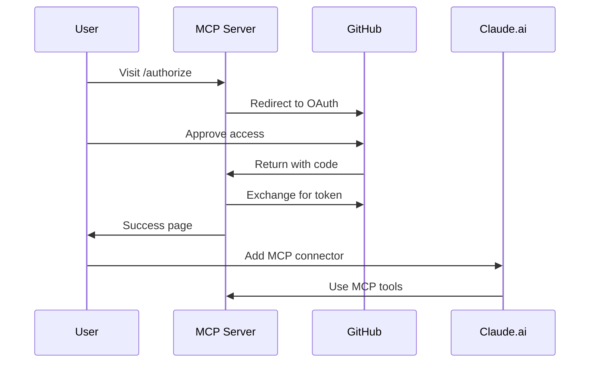

# MCP (Model Context Protocol) Setup Guide

## Quick Start for Claude.ai

### 1. Add to Claude.ai Custom Connectors

Use the dedicated MCP endpoint:
```
https://mcp.changeflow.us/mcp
```

### 2. Authenticate with GitHub

1. Visit: https://mcp.changeflow.us/authorize
2. Authorize with your GitHub account
3. You'll be redirected back with confirmation

## Available Endpoints

### Production Domains
- **MCP Endpoint**: `https://mcp.changeflow.us/mcp` (Primary for Claude.ai)
- **API Endpoint**: `https://api.changeflow.us/` (Legacy)
- **Health Check**: `https://mcp.changeflow.us/health`

### Workers.dev Endpoints (Backup)
- **Production**: `https://guile-changeflow-prod.jasonwalsh.workers.dev/`
- **Staging**: `https://guile-changeflow-staging.jasonwalsh.workers.dev/`

## Available MCP Tools

### Change Management Tools

1. **create_change_request**
   - Create new ITIL 4 compliant change requests
   - Automatic risk assessment
   - Environment: development, staging, production
   - Change types: standard, normal, emergency

2. **assess_risk**
   - Evaluate risk score for changes
   - Returns: LOW, MEDIUM, HIGH, CRITICAL
   - Factors: environment, security impact, payment systems

3. **check_freeze_period**
   - Verify if date falls within change freeze
   - Includes holidays and critical business periods
   - Returns freeze type: full, partial, none

4. **get_change_request**
   - Retrieve specific change request details
   - Includes status, risk score, approvals

5. **list_change_requests**
   - List all change requests
   - Filter by status: pending, approved, rejected, completed

6. **get_approval_status**
   - Check CAB (Change Advisory Board) approval status
   - Returns: AUTO_APPROVED, PENDING_REVIEW, REQUIRES_CAB, EMERGENCY_CAB

7. **emergency_override**
   - Request emergency override for critical changes
   - Requires justification
   - Creates audit trail

8. **audit_trail**
   - Get complete audit history for a change
   - Includes all status changes and approvals

## OAuth Configuration

### GitHub OAuth Setup
1. The server uses GitHub OAuth for authentication
2. Scopes required: `read:user`
3. Token stored securely in Cloudflare KV (production)

### Authorization Flow


## Testing the Connection

### 1. Health Check
```bash
curl https://mcp.changeflow.us/health
```

Expected response:
```json
{
  "status": "healthy",
  "service": "Guile ChangeFlow MCP Server",
  "version": "1.2.0",
  "capabilities": ["mcp", "change_management", "risk_assessment", "oauth"]
}
```

### 2. MCP Info
```bash
curl https://mcp.changeflow.us/mcp
```

### 3. Test MCP Protocol
```bash
curl -X POST https://mcp.changeflow.us/mcp \
  -H "Content-Type: application/json" \
  -d '{"jsonrpc":"2.0","method":"tools/list","id":1}'
```

## Freeze Periods (2025-2026)

The system enforces the following change freeze periods:

| Period | Dates | Type | Description |
|--------|-------|------|-------------|
| Holiday Season | Dec 20, 2025 - Jan 5, 2026 | Full | Complete freeze |
| Pre-Cyber Monday | Nov 1-Dec 2, 2025 | Partial | Limited changes |
| Black Friday/Cyber Monday | Nov 24-Dec 2, 2025 | Full | Shopping season |
| Thanksgiving | Nov 25-30, 2025 | Full | Holiday weekend |
| Independence Day | Jul 3-6, 2025 | Full | Holiday weekend |

## Risk Assessment Matrix

| Factor | Weight | Trigger |
|--------|--------|---------|
| Production Environment | +40 | `environment: "production"` |
| Security Changes | +30 | Description contains "security" |
| Payment Systems | +20 | Description contains "payment" |
| Emergency Change | +25 | `changeType: "emergency"` |
| System Impact | +10 | Multiple system changes |
| Base Score | 10 | All changes start here |

### Risk Levels
- **LOW**: 0-25 points → Auto-approved
- **MEDIUM**: 26-50 points → Pending review
- **HIGH**: 51-75 points → Requires CAB
- **CRITICAL**: 76+ points → Emergency CAB

## Troubleshooting

### Common Issues

1. **404 on /authorize**
   - Check you're using mcp.changeflow.us (not api.changeflow.us)
   - Ensure v1.2.0 is deployed

2. **OAuth Redirect Issues**
   - Verify GitHub OAuth app configured correctly
   - Check redirect URI matches deployment

3. **MCP Tools Not Available**
   - Confirm /mcp endpoint returns tool list
   - Check Claude.ai connector configuration

### Debug Commands
```bash
# Check version
curl -s https://mcp.changeflow.us/health | jq .version

# List available tools
curl -s -X POST https://mcp.changeflow.us/mcp \
  -H "Content-Type: application/json" \
  -d '{"jsonrpc":"2.0","method":"tools/list","id":1}' | jq .result.tools[].name

# Test change creation (example)
curl -s -X POST https://mcp.changeflow.us/mcp \
  -H "Content-Type: application/json" \
  -d '{
    "jsonrpc":"2.0",
    "method":"tools/call",
    "params":{
      "name":"create_change_request",
      "arguments":{
        "title":"Test Change",
        "description":"Testing MCP integration",
        "environment":"development"
      }
    },
    "id":2
  }'
```

## Support

- **GitHub Issues**: https://github.com/dsp-dr/guile-changeflow/issues
- **Documentation**: https://github.com/dsp-dr/guile-changeflow/docs
- **Status Page**: Check `/health` endpoint

## Version History

- **v1.2.0**: OAuth support, dedicated MCP domain, Remote MCP Server compatible
- **v1.0.0**: Initial release with basic ITIL tools

---

*Last Updated: September 14, 2025*